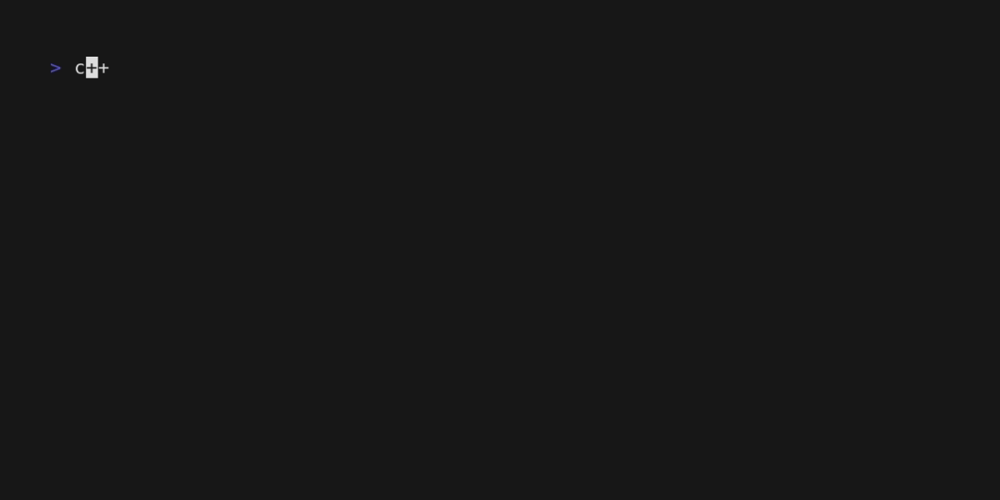

<div align="center">

# Slangroom-exec <!-- omit in toc -->

### The missing [slangroom](https://dyne.org/slangroom) executor <!-- omit in toc -->

</div>

<p align="center">
  <a href="https://dyne.org">
    
  </a>
</p>

---
<br><br>

## ✨ Slangroom-exec features <!-- omit in toc -->

`slangroom-exec` is a simple utility that reads from STDIN the following content

1. conf
2. slangroom-contract
3. data
4. keys
5. extra
6. context

separated each per new-line and encoded in `base64` (it seems difficult, but [slexfe helper tool](#-slexfe) is here for that) and outputs the slangroom execution to stoud.



***

<div id="toc">

### 🚩 Table of Contents  <!-- omit in toc -->

- [🎮 Quick start](#-quick-start)
- [💾 Build](#-build)
- [🪛 Slexfe](#-slexfe)
	- [🧩 Usage](#-usage)
- [🐛 Troubleshooting \& debugging](#-troubleshooting--debugging)
- [😍 Acknowledgements](#-acknowledgements)
- [👤 Contributing](#-contributing)
- [💼 License](#-license)

</div>

***
## 🎮 Quick start

Slangroom-exec is in [mise](https://mise.jdx.dev/) and can be installed from it or directly from github releases:

```bash
# download the executable from mise
mise use "aqua:dyne/slangroom-exec"
# or from github releases
wget https://github.com/dyne/slangroom-exec/releases/latest/download/slangroom-exec-$(uname)-$(uname -m) -O ~/.local/bin/slangroom-exec && chmod +x ~/.local/bin/slangroom-exec

# execute a simple slangroom contract
wget -qO - https://raw.githubusercontent.com/dyne/slangroom-exec/main/test/fixtures/welcome.slex | slangroom-exec
```

**[🔝 back to top](#toc)**
***

## 💾 Build

To be able to build slangroom-exec you need the following dependencies to be available in your PATH:
* node@22
* bun@1.1.40

You can install them by hand or use [mise](https://mise.jdx.dev/) and run `mise install` in the root of the repository.

You can build the executable following the steps:

```bash
# clone the repository and enter in it
git clone https://github.com/dyne/slangroom-exec
cd slangroom-exec

# if you decided to use mise now run: mise install

# build the executable
make slangroom-exec
```

**[🔝 back to top](#toc)**
***

## 🪛 Slexfe

The `SLangroom-EXec Format Encode` (aka `slexfe`) script is used to encode the human readable
input of slangroom-exec, *i.e.*
* the slangroom configuration
* the slangroom contract
* the slangroom keys/data/extra/context

into the base64 multiline encoded machine-readable version of it and the result is printed
to stdout.

### 🧩 Usage

As said before `slexfe` can take in input up to 6 files and they should be iondicate with the
right flag:

```
-c or --conf                for conf
-s or --slangroom-contract  for slangroom-contract
-d or --data                for data
-k or --keys                for keys
-e or --extra               for extra
-x or --context             for context
```

If all the files have the same name and they follow the slangroom name contention, that is:

* conf:                `${name}.conf`
* slangroom-contract:  `${name}.slang`
* data:                `${name}.data.json`
* keys:                `${name}.keys.json`
* extra:               `${name}.extra.json`
* context:             `${name}.context`


you can use the `-F` flag. So for example

```bash
slexfe -c hello.conf -s hello.slang -d hello.data.json -k hello.keys.json -e hello.extra.json -x hello.context
```

will be equal to

```bash
slexfe -F hello
```

Pay attention, this works also when not all the files are definted.

A last feature to help in the easier cases, when something  is passed in `/dev/stdin`
to `slexfe`, *e.g.*:
```
cat hello.slang | slexfe
```
it is interpreted as the slangroom contract. This also overwrites the
`--slangroom-contract` option flag if passed as a duplicate.

**[🔝 back to top](#toc)**
***

## 🐛 Troubleshooting & debugging

Availabe bugs are reported via [GitHub issues](https://github.com/dyne/slangroom-exec/issues).

**[🔝 back to top](#toc)**
***

## 😍 Acknowledgements

Copyright © 2024-2025 by [Dyne.org](https://www.dyne.org) foundation, Amsterdam.

**[🔝 back to top](#toc)**
***

## 👤 Contributing

1.  🔀 [FORK IT](../../fork)
2.  Create your feature branch `git checkout -b feature/branch`
3.  Commit your changes `git commit -am 'feat: New feature\ncloses #398'`
4.  Push to the branch `git push origin feature/branch`
5.  Create a new Pull Request `gh pr create -f`
6.  🙏 Thank you


**[🔝 back to top](#toc)**
***

## 💼 License

    Slangroom-exec - The missing slangroom executor
    Copyleft 🄯 2024-2025 Dyne.org foundation, Amsterdam

    This program is free software: you can redistribute it and/or modify
    it under the terms of the GNU Affero General Public License as
    published by the Free Software Foundation, either version 3 of the
    License, or (at your option) any later version.

    This program is distributed in the hope that it will be useful,
    but WITHOUT ANY WARRANTY; without even the implied warranty of
    MERCHANTABILITY or FITNESS FOR A PARTICULAR PURPOSE.  See the
    GNU Affero General Public License for more details.

    You should have received a copy of the GNU Affero General Public License
    along with this program.  If not, see <http://www.gnu.org/licenses/>.

**[🔝 back to top](#toc)**
